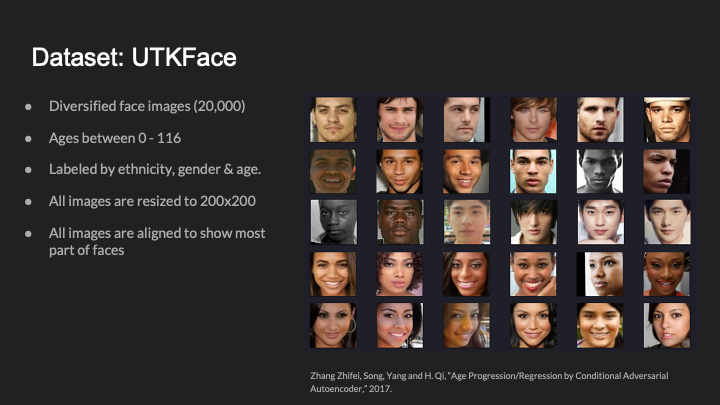
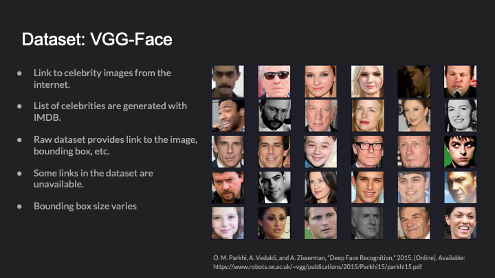
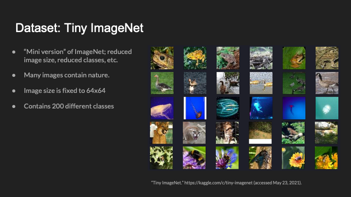
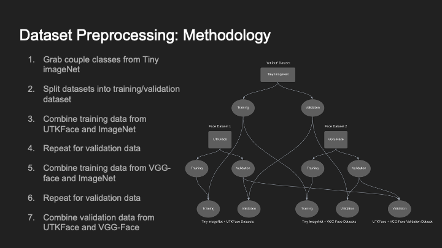
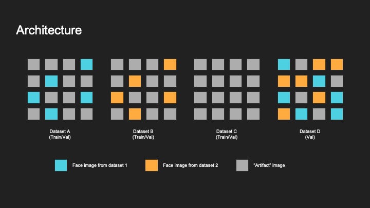
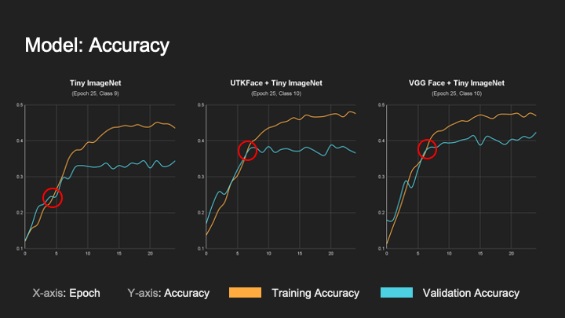
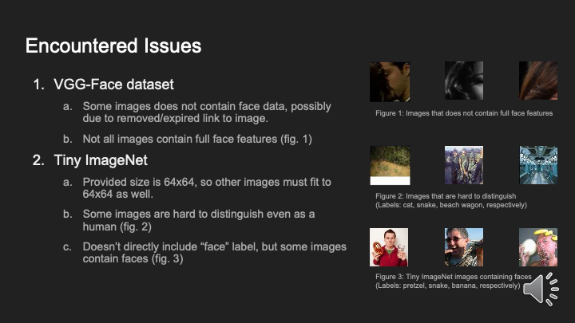

# CSS490_Final_Project
Overview
We will have a goal of analyzing two well-known face recognition datasets ([VGG Face](https://www.robots.ox.ac.uk/~vgg/data/vgg_face/) and [UTKFace](https://susanqq.github.io/UTKFace/)) and explore if there are biases in two datasets by training two identical models (ResNet) and compare the accuracy of each model. We added [Tiny ImageNet](https://www.kaggle.com/c/tiny-imagenet) for an artificial dataset.

Datasets

